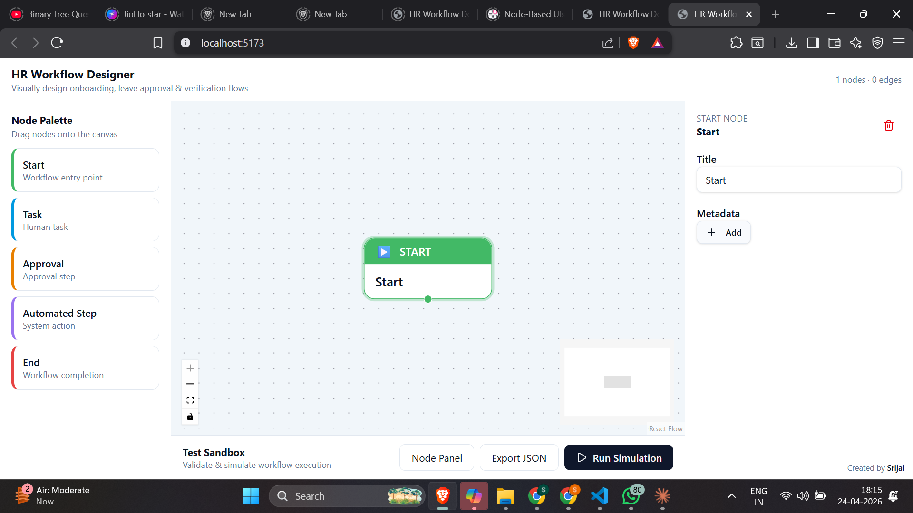
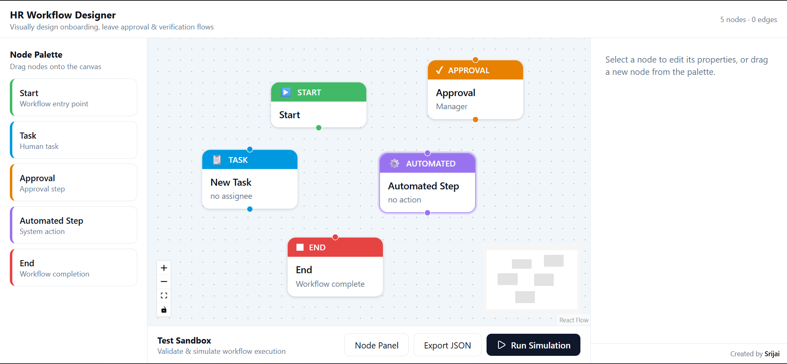
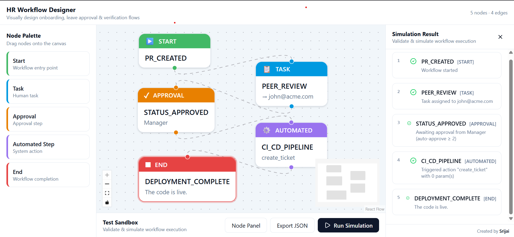
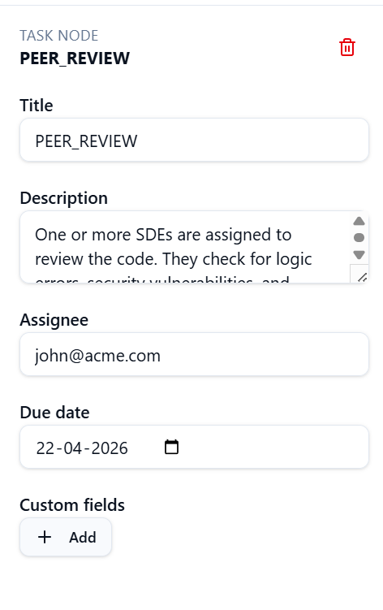
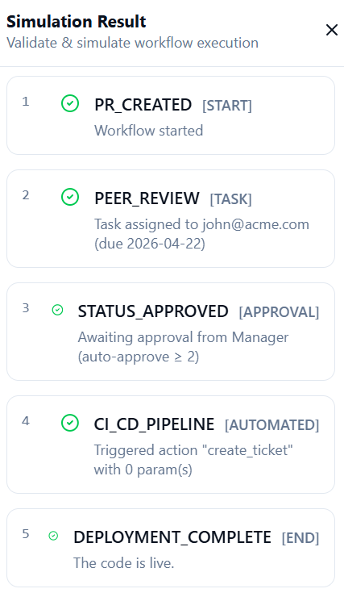
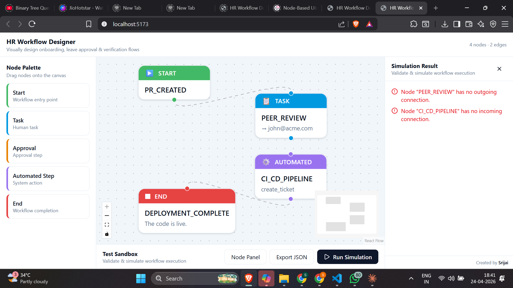
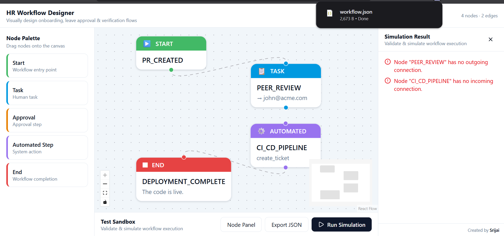

# HR Workflow Designer


## 🌐 Live Demo
https://hr-workflow-designer-lyart.vercel.app/

A mini HR Workflow Designer built with **React + TypeScript + React Flow** that allows HR administrators to visually create, configure, validate, and simulate internal workflows such as onboarding, leave approvals, and document verification.

## Stack
- **React 19 + TypeScript** on TanStack Start (Vite)
- **React Flow (`reactflow`)** for the canvas
- **shadcn/ui + Tailwind v4** for UI primitives & design tokens

## ▶ How to Run

```bash
npm install
npm run dev
```
## Features
- Drag-and-drop workflow canvas
- Multiple custom node types
- Dynamic node configuration forms
- Workflow validation engine
- Simulation / sandbox execution panel
- Mock API integration
- Export workflow JSON
- Responsive multi-panel layout


## Architecture

```
src/
├─ types/workflow.ts          # Strongly-typed node data, automations, simulation result
├─ api/mockApi.ts             # Mock GET /automations & POST /simulate (in-memory, async)
├─ workflow/
│  ├─ nodeDefaults.ts         # Factory for default data per node kind
│  ├─ useWorkflow.ts          # Custom hook: nodes/edges/selection state + mutations
│  ├─ nodes/CustomNodes.tsx   # 5 React Flow custom node renderers (Start/Task/Approval/Automated/End)
│  ├─ NodePalette.tsx         # Drag-source sidebar
│  ├─ NodeConfigPanel.tsx     # Dynamic per-kind config form (right rail)
│  ├─ SandboxPanel.tsx        # Run simulation + step-by-step log (bottom)
│  └─ WorkflowDesigner.tsx    # Composes layout + ReactFlowProvider
└─ routes/index.tsx           # Route entry
```

### Design choices
- **Separation of concerns**: canvas state lives in `useWorkflow` (a single hook), nodes are pure renderers driven by `data`, the API layer is fully isolated and async (easy to swap for `fetch`/MSW later).
- **Type-driven extensibility**: adding a new node kind = (1) extend `NodeKind` + `NodeDataMap`, (2) add a factory in `nodeDefaults`, (3) add a renderer in `CustomNodes`, (4) add a form branch in `NodeConfigPanel`. No other code changes.
- **Dynamic forms**: the Automated Step node fetches actions from the mock API and renders parameter inputs *based on the action's declared params* — fully data-driven.
- **Validation in the API layer**: `/simulate` performs structural checks (single Start, ≥1 End, no orphan nodes, no cycles via DFS coloring) before producing the execution trace, so the same logic would work against a real backend.
- **Single Start enforced** in `addNode`.

### Mock API
- `getAutomations()` → list of automated actions with declared params (`send_email`, `generate_doc`, `slack_notify`, `create_ticket`).
- `simulateWorkflow({ nodes, edges })` → BFS traversal from Start, emitting one `SimulationStep` per node with status `ok | warn | error` and a human-readable message. Cycle detection + connectivity validation up front.

### Assumptions
- No persistence; refreshing resets the canvas (per spec — no backend required).
- Edges are simple directed connections; conditional/branch labeling is out of scope.
- Auth/RBAC is out of scope.
- `MiniMap`, zoom controls and animated edges are included as light bonuses.

## Completed

- Drag/drop nodes
- Connect edges
- Delete nodes / edges
- Start / Task / Approval / Automated / End nodes
- Dynamic node forms
- Validation engine
- Simulation engine
- Export JSON
- MiniMap + Zoom controls

## With More Time

- Save workflows to database
- Import JSON
- Conditional branches
- Parallel approvals
- Real backend APIs
- Live animated simulation
- Role-based permissions
- Workflow templates

# 📸 Screenshots

## 1. Home Overview



## 2. Nodes Added



## 3. Workflow Connected



## 4. Task Node Configuration



## 5. Simulation Result



## 6. Validation Errors



## 7. Export JSON




## Author

Created by Srijai